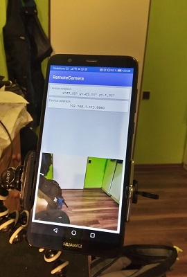

# Android Remote Camera
Tool designed for taking test pictures for AR project. Control phone camera via tcpIP packet. The phone also sends its current rotation.

**NOTE: I am still working on this project. It is not completely finished.**

  

## Python requirements
 - numpy
 - matplotlib
 - PIL

## How to use
 1. Clone the project and open it in Android Studio
 2. Let Gradle install all you need
 3. Build and install the app on your phone
 4. Launch the app. Make sure your phone is connected to the same network as your computer
 5. Open python **PythonScripts/main.py** and change the address to the address you see in the app
```python
SERVER_ADDRESS = "192.168.1.113"
```
 6. Run the script. The phone takes a picture and sends it into your computer. In the console you see phone rotation angles. The picture can be found here:  **PythonScripts/out.jpg**

